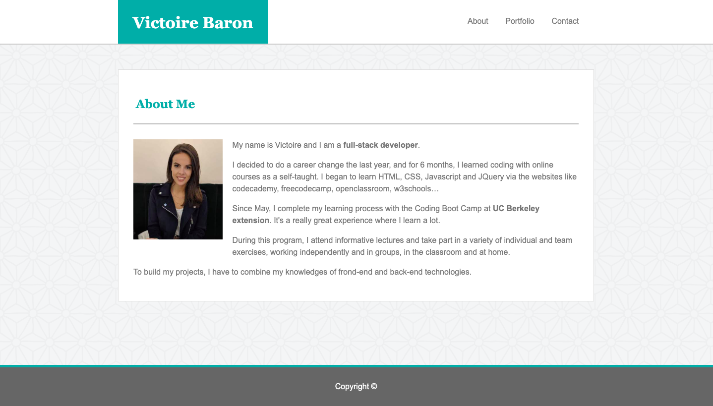
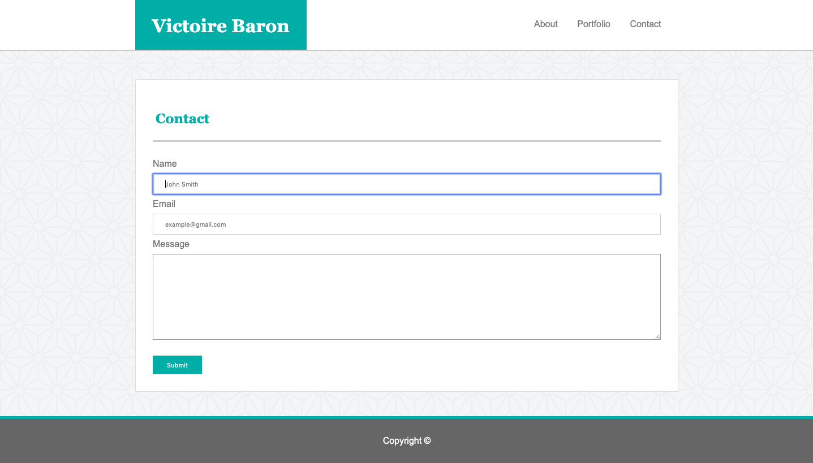

# Basic-Portfolio

## Quick start
Open `index.html` in your browser.

## Excercice resolution steps
The purpose of this excercise from UC Berkeley extension is to use HTML and CSS.
Firstly, I build the structure of my three webpages with HTML elements (semantic tags). 
Then, I insert the CSS to give style at my website. 
This website present 3 tabs (About me, Portfolio, Contact) to allow the user to navigate between the differentes pages. 

## technologies Used

* [HTML](https://developer.mozilla.org/en-US/docs/Web/HTML)
* [CSS](https://developer.mozilla.org/en-US/docs/Web/CSS)

## Author

Victoire Baron 

